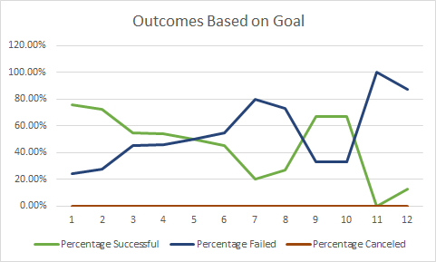
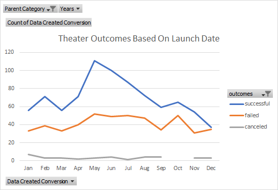

# An Analysis of Kickstarter Campaigns For Fever

# Overview
The purpose of this analysis is to show comparisons between different kickstarter campaigns, their launch datas, and their funding goals to see how successful or unsuccessful they were.

# Analysis and Challenges
The first course of actin was to seperate the years from the Date Creates Conversion worksheet; this will be paired with the thearters (parent category) to help filter the pivot chart that we can specify which were successful, a failure, and canceld. One of the challeneges that occured was finding the number of canceled plays in Outcomes Based On Goals Chart because all of the cells were 0s, which caused confusion, but, after evaluating and double checking, it was decided that there were no errors. 
Explain how you performed your analysis using images and links to code, as well as any challenges you encountered and how you overcame them. If you had no challenges, describe any possible challenges or difficulties that could be encountered.

# Results
Based on the information provided in the Theater Outcomes Based On Launch Data chart, theater are successful in May to July and numbers decreases around the winter time. Even with this said, April through October show the most failed productions, except for September. As for plays, it has been concluded that goals are reached when they are in the range os 4999 or less or 35000 to 44999 as expressed in the Outcomes Based On Goals Chart. Since no location was specified, all countries and currencies were used for this data; this causes limit of specific data because some places are more populated than others, the interest of plays versus theaters vary, and money does not have all the same value--for instance, a pound in Great Britian is a different value than a dollar in the United States. A suggested chart that could help would be a bar or line chart because comparing the lengths of each is easier than comparing at intersecting lines. 

